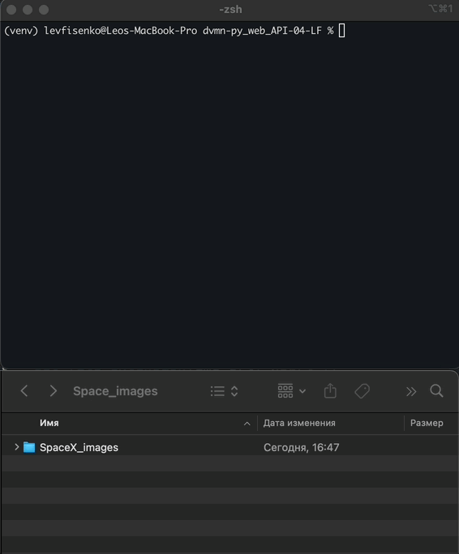
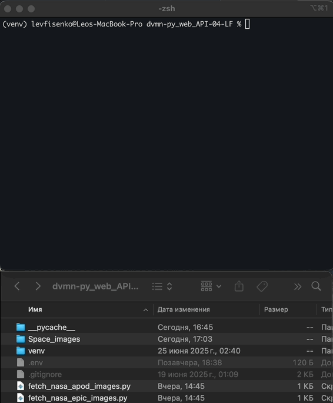
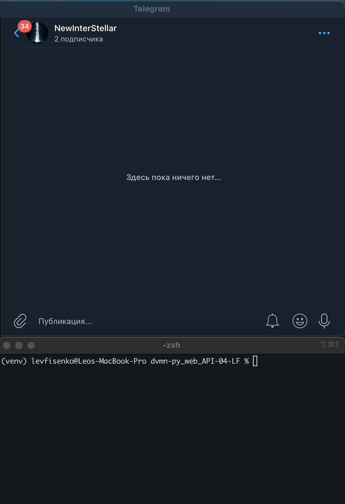
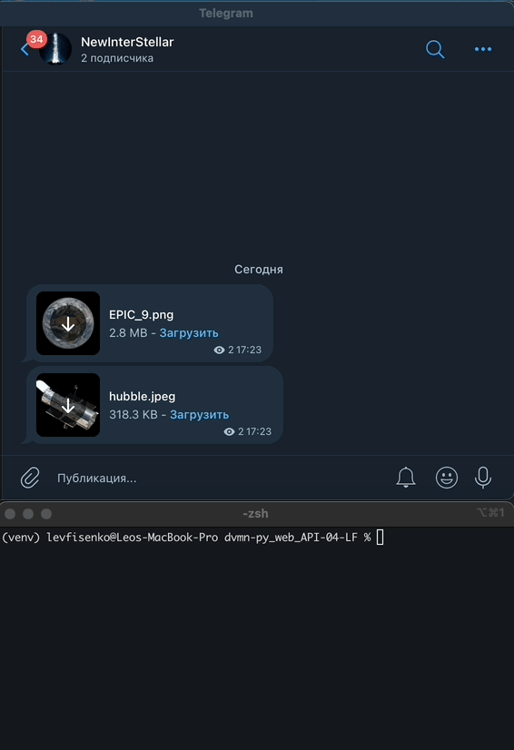

# Космический Телеграм

Программа позволяет:
1. Автоматически публиковать фотографии в Telegram канал из выбранной директории через равные промежутки времени (по умолчанию каждые 4 часа).
2. Публиковать вручную выбранную фотографию.
3. Автоматически скачивать фотографии с сервисов "SpaceX", "NASA APOD", "NASA EPIC".


### Как установить

Для работы с телеграм ботом Вам необходимо его создать и получить его токен [BotFather](https://telegram.me/BotFather).
Также необходимо получить [API_KEY_NASA](https://api.nasa.gov) для скачивания фотографий.
Рекомендуем создать локально файл `.env` с требуемыми секретными данными.

Рекомендуется использовать [virtualenv/venv](https://docs.python.org/3/library/venv.html) для изоляции проекта. 

Для запуска необходима версия [Python 3.11.*](https://www.python.org/downloads/) и младше 3.10.* так-как модуль imghdr, встроенный в старые версии Python, удалён в Python 3.13. А библиотека python-telegram-bot, всё ещё зависит от него.
Затем используйте `pip` (или `pip3`, есть конфликт с Python2) для установки зависимостей:
```
pip install -r requirements.txt
```

### Как запустить ###

1. Запускаем терминал - Terminal (macOS/Linux), Windows Terminal (cmd.exe).
2. Переходим в директорий программы.
3. Проверяем версию Python `python --version` и какие установлены библиотеки `pip freeze`.
4. В случае успеха. Запускаем нужную программу:

### Как использовать ###

1. Скрипт `fetch_spacex_images.py` скачивает в директорию проекта фотографии запуска ракет SpaceX по введенному ID, либо последние - по умолчанию.


3. Скрипт `fetch_nasa_apod_images.py` скачивает в директорию проекта 30 случайных фотографии дня космоса от NASA APOD.



4. Скрипт `fetch_nasa_epic_images.py` скачивает в директорию проекта 10 последних фотографии земли NASA EPIC.



5. Скрипт `tg_publish_image.py` публикует в указанном телеграм канале выбранную фотографию по её пути.



6. Скрипт `tg_auto_publish_images.py` автоматически публикует фотографии из указанной директории в указанный телеграм канал.



### Цель проекта

Код написан в образовательных целях на онлайн-курсе для веб-разработчиков [dvmn.org](https://dvmn.org/).
